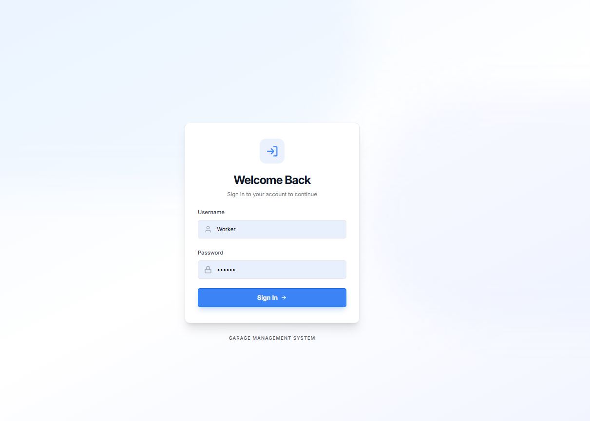
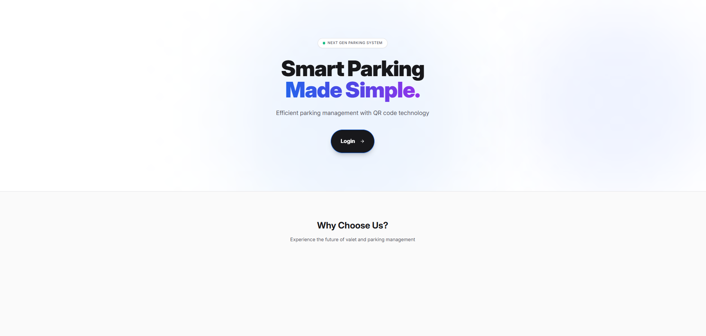
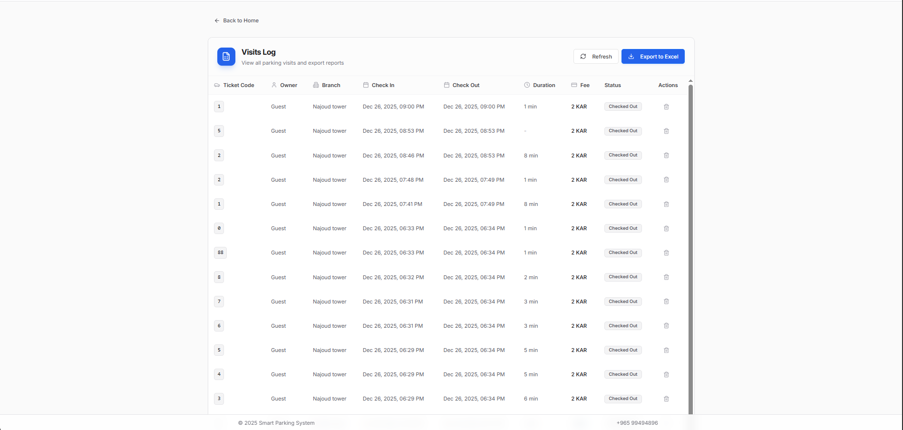

# 🚗 NextGen Valet Parking Management System

A comprehensive full-stack **Valet Parking Management System** with QR code ticketing, real-time updates, and multi-branch support. Perfect for hotels, restaurants, malls, and parking garages.

## 🌐 Live Demo

🔗 **[Try it Live](https://garage-sys-front.pages.dev)**

---

## 📸 Screenshots

### 🔐 Login Page

### 🔐 Admin Login

### 🏠 Home Dashboard

### 👷 Worker Dashboard - Active Visits & Pickup Requests

### 📊 Admin Dashboard - Statistics & Analytics
.png)

### 📷 QR Code Scanner - Check-in/Check-out

### 🎫 QR Code Ticket Example

### ⚙️ System Configuration - Branches, Workers & Fees

### 📋 Activity Log

### 📊 Reports & Analytics

---

## ✨ Key Features

### 🎫 Smart QR Ticketing System
- Auto-generate unique QR codes for each vehicle
- Print-ready tickets with parking info
- Customers scan QR to request car retrieval
- Real-time ticket status tracking

### 👥 Multi-Role Access Control
| Role | Capabilities |
|------|--------------|
| **Admin** | Full system control, analytics, manage branches & workers, settings |
| **Worker** | Check-in/out vehicles, handle pickup requests, view active visits |
| **Customer** | Request car pickup by scanning QR code |

### 🏢 Multi-Branch Management
- Create and manage multiple parking locations
- Assign workers to specific branches
- Per-branch settings (capacity, fees)
- Branch-specific analytics

### 📊 Real-Time Dashboard & Analytics
- Live active visits monitoring
- Pickup request notifications (Socket.IO)
- Revenue tracking per period (24h, 7d, 30d, 1y)
- Visit history with search & filter
- Export to Excel (XLSX)

### 🌐 Bilingual (Arabic & English)
- Full RTL support for Arabic
- Language toggle in header
- All text fully translated

---

## 🛠️ Tech Stack

### Backend
| Technology | Purpose |
|------------|---------|
| **Node.js** | Runtime |
| **Express.js** | REST API |
| **MongoDB** | Database |
| **Mongoose** | ODM |
| **JWT** | Authentication |
| **Socket.IO** | Real-time updates |
| **QRCode** | QR generation |
| **XLSX** | Excel export |
| **bcryptjs** | Password hashing |

### Frontend
| Technology | Purpose |
|------------|---------|
| **React 18** | UI Framework |
| **TypeScript** | Type Safety |
| **Vite** | Build Tool |
| **TailwindCSS** | Styling |
| **Shadcn/UI** | UI Components |
| **React Query** | Data Fetching & Caching |
| **Framer Motion** | Animations |
| **html5-qrcode** | QR Camera Scanner |
| **Wouter** | Routing |
| **Zod** | Validation |

---

## 📱 Application Pages

| Page | Route | Description |
|------|-------|-------------|
| Landing | `/` | Hero section with features |
| Login | `/login` | JWT authentication |
| Home | `/home` | Role-based dashboard |
| Register Car | `/register` | Check-in vehicle + QR |
| Scanner | `/scan` | QR/Manual check-in/out |
| Visits | `/visits` | Visit history + export |
| Worker Dashboard | `/worker` | Active visits & requests |
| Admin Dashboard | `/admin` | Full analytics |
| Admin Settings | `/admin/settings` | Branches, workers, fees |
| Pickup Request | `/request/:qr` | Customer pickup page |

---

## 🚀 Deployment Ready

- ✅ **Vercel** - `vercel.json` included
- ✅ **Cloudflare Pages** - `_redirects` configured
- ✅ **Azure / IIS** - `web.config` ready
- ✅ **Google App Engine** - `app.yaml` included

---

## 📦 What's Included

| Item | Description |
|------|-------------|
| ✅ Full Source Code | Frontend (React/TS) + Backend (Node.js) |
| ✅ Database Models | MongoDB schemas with Mongoose |
| ✅ Authentication | JWT with bcrypt password hashing |
| ✅ Real-time Updates | Socket.IO integration |
| ✅ Seed Script | Quick database setup |
| ✅ Deployment Configs | Vercel, Azure, Cloudflare |
| ✅ Responsive Design | Mobile-first approach |
| ✅ Bilingual | Arabic & English support |

---

## 💰 Price: $30

> ⚠️ **Note**: Source code is delivered after purchase. Demo available for testing.

---

## 🏷️ Tags

`valet-parking` `parking-management` `qr-code` `mern-stack` `react` `nodejs` `mongodb` `typescript` `tailwindcss` `real-time` `socket-io` `admin-dashboard` `multi-branch` `arabic-english` `bilingual` `hotel-management` `full-stack` `shadcn-ui`

---

**Perfect For:**
- 🏨 Hotels & Resorts
- 🛒 Shopping Malls  
- 🍽️ Restaurants & Clubs
- 🅿️ Parking Garages
- 🎉 Event Venues
- 🏥 Hospitals
